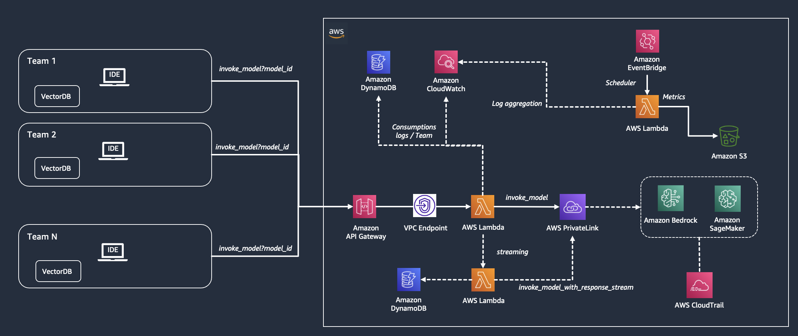
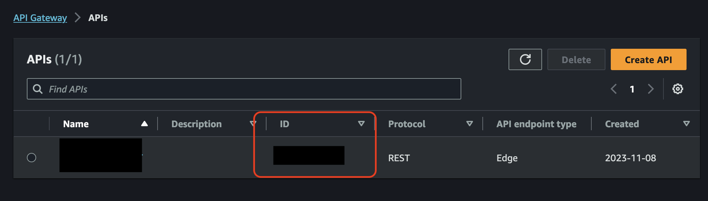
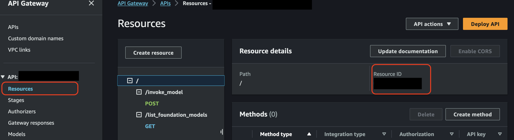

# Multi-tenant Generative AI gateway with cost and usage tracking on AWS

In this repository, we show you how to build a multi-tenant SaaS solution to access foundation models with [Amazon Bedrock](https://aws.amazon.com/bedrock/) 
and [Amazon SageMaker](https://aws.amazon.com/sagemaker/).

Enterprise IT teams may need to track the usage of FMs across teams, chargeback costs and provide visibility to the relevant cost center in the LOB. Additionally, they may need to regulate access to different models per team. For example, if only specific FMs may be approved for use.

An internal software as a service (SaaS) for foundation models can address governance requirements while providing a simple 
and consistent interface for the end users. API Gateway is a common design pattern that enable consumption of services with 
standardization and governance. They can provide loose coupling between model consumers and the model endpoint service that 
gives flexibility to adapt to changing model versions, architectures and invocation methods.

1. [Project Description](#project-description)
2. [API Specifications](#api-specifications)
3. [API Consumption](#api-consumption)
3. [Reporting Costs Example](#reporting-costs-example)
4. [Deploy Stack](#deploy-stack)
   1. [Full Deployment](#full-deployment)
   2. [API Key Deployment](#api-key-deployment)
5. [Destroy Stack](#destroy-stack)
   1. [Destroy all the stacks](#destroy-all-the-stacks)
   2. [Destroy a specific stack](#destroy-a-specific-stack)
6. [SageMaker Endpoints](#sagemaker-endpoints)

## Project Description

Multiple tenants within an enterprise could simply reflect to multiple teams or projects accessing LLMs via REST APIs just like other SaaS services. IT teams can add additional governance and controls over this SaaS layer. In this cdk example, we focus specifically on showcasing multiple tenants with different cost centers accessing the service via API gateway. An internal service is responsible to perform usage and cost tracking per tenant and aggregate that cost for reporting. The cdk template provided here deploys all the required resources to the AWS account. 



The CDK Stack provides the following deployments:

#### Full Deployment: It deploys the following resources:

1. Private Networking environment with VPC, Private Subnets, VPC Endpoints for Lambda, API Gateway, and Amazon Bedrock
2. API Gateway Rest API
3. API Gateway Usage Plan
4. API Gateway Key 
5. Lambda functions to list foundation models on Bedrock
6. Lambda functions to invoke models on Bedrock and SageMaker
7. Lambda functions to invoke models on Bedrock and SageMaker with streaming response
8. DynamoDB table for saving streaming responses asynchronously 
9. Lambda function to aggregate usage and cost tracking 
10. EventBridge to trigger the cost aggregation on a regular frequency 
11. S3 buckets to store the cost tracking logs 
12. Cloudwatch logs to collect logs from Lambda invocations

#### API Key Deployment: It deploys the following resources:
1. API Gateway Usage Plan
2. API Gateway Key 

Sample notebook in the notebooks folder can be used to invoke Bedrock as either one of the teams/cost_center. API gateway 
then routes the request to the lambda that invokes Bedrock models or SageMaker hosted models and logs the usage metrics to cloudwatch. 
EventBridge triggers the cost tracking lambda on a regular frequnecy to aggregate metrics from the cloudwatch logs and 
generate aggregate usage and cost metrics for the chosen granularity level. The metrics are stored in S3 and can further 
be visualized with custom reports. 

## API Specifications

The CDK Stack creates Rest API compliant with OpenAPI specification standards.

The solution is currently support both **REST** invocation and **Streaming** invocation with long polling for Bedrock and SageMaker.

### OpenAPI 3

```
openapi: 3.0.1
info:
  title: "<REST_API_NAME>"
  version: '2023-12-13T12:12:15Z'
servers:
- url: https://<HOST>.execute-api.<REGION>.amazonaws.com/{basePath}
  variables:
    basePath:
      default: prod
paths:
  "/list_foundation_models":
    get:
      responses:
        '401':
          description: 401 response
          headers:
            Access-Control-Allow-Origin:
              schema:
                type: string
          content:
            application/json:
              schema:
                "$ref": "#/components/schemas/Error"
      security:
      - api_key: []
  "/invoke_model":
      requestBody:
        required: true
        content:
          application/json:
             schema:
               $ref: '#/components/schemas/InvokeModelRequest'
      parameters:
      - name: model_id
        in: query
        required: true
        schema:
          type: string
        description: Id of the base model to invoke
      - name: model_arn
        in: query
        required: true
        schema:
          type: string
        description: ARN of the custom model in Amazon Bedrock
      - name: requestId
        in: query
        required: false
        schema:
          type: string
        description: Request ID for long-polling functionality. Requires streaming=true
      - name: team_id
        in: header
        required: true
        schema:
          type: string
      - name: messages_api
        in: header
        required: false
        schema:
          type: string
      - name: streaming
        in: header
        required: false
        schema:
          type: string
      - name: type
        in: header
        required: false
        schema:
          type: string
      responses:
        '401':
          description: 401 response
          headers:
            Access-Control-Allow-Origin:
              schema:
                type: string
          content:
            application/json:
              schema:
                "$ref": "#/components/schemas/Error"
      security:
      - api_key: []
components:
  schemas:
   InvokeModelRequest:
      type: object
      required:
        - inputs
        - parameters
      properties:
        inputs:
          $ref: '#/components/schemas/Prompt'
        parameters:
          $ref: '#/components/schemas/ModelParameters'
        tool_config:
          $ref: '#/components/schemas/ToolConfig'
   Prompt:
      type: object
      example:
        - role: 'user'
          content: 'What is Amazon Bedrock?'
    ModelParameters:
      type: object
      properties:
        maxTokens:
          type: integer
          required: false
        temperature:
          type: number
          required: false
        topP:
          type: number
          required: false
        stopSequences:
          type: array
          required: false
          items:
            type: string
        system:
          type: string
          required: false
    ToolConfig:
      type: object
      required: false
      properties:
        tools:
          type: array
          required: true
          properties:
            toolSpec:
              type: object
              required: true
   
   Error:
      title: Error Schema
      type: object
      properties:
        message:
          type: string
  securitySchemes:
    api_key:
      type: apiKey
      name: x-api-key
      in: header
```

## API Consumption

The solution is providing two example notebooks for testing API requests with raw API invocation and with Langchain integration:
1. Raw API: [01_bedrock_api.ipynb](./notebooks/01_bedrock_api.ipynb)
2. Langchain Integration [02_bedrock_api_langchain.ipynb](./notebooks/02_bedrock_api_langchain.ipynb)

### How to get the API Gateway Endpoint:
Navigate the Cloudformation deployment, get the value under `awsiapigwurl`

### How to get the API Key:
1. Navigate the AWS Console
2. Search for API Gateway
3. Select the deployed `API Gateway`
4. Copy the value from `API keys`

## Reporting Costs Example

| team_id | model_id | input_tokens | output_tokens | invocations | input_cost | output_cost |
|---------|----------|--------------|---------------|-------------|------------|-------------|
| tenant1 | amazon.titan-tg1-large | 24000        | 2473          | 1000        | 0.0072     | 0.00099     |
| tenant1 | anthropic.claude-v2 | 2448         | 4800          | 24          | 0.02698    | 0.15686     |
| tenant2 | amazon.titan-tg1-large | 35000        | 52500         | 350         | 0.0105     | 0.021       |
| tenant2 | ai21.j2-grande-instruct | 4590         | 9000          | 45          | 0.05738    | 0.1125      |
| tenant2 | anthropic.claude-v2 | 1080         | 4400          | 20          | 0.0119     | 0.14379     |

## Deploy Stack

### Note

The following examples are providing guidelines on the structure for the configuration file. 
Please make sure to look at [setup/configs.json](./setup/configs.json) for the most updated version of the file.

### Full Deployment

#### Step 1

Edit the global configs used in the CDK Stack. For each organizational units that requires a dedicated multi-tenant SaaS environment, create an entry in [setup/configs.json](./setup/configs.json)

```
[
  {
    "STACK_PREFIX": "", # unit 1 with dedicated SaaS resources
    "BEDROCK_ENDPOINT": "https://bedrock-runtime.{}.amazonaws.com", # bedrock-runtime endpoint used for invoking Amazon Bedrock
    "BEDROCK_REQUIREMENTS": "boto3>=1.34.62 awscli>=1.32.62 botocore>=1.34.62", # Requirements for Amazon Bedrock
    "LANGCHAIN_REQUIREMENTS": "aws-lambda-powertools langchain==0.1.12 pydantic PyYaml", # python modules installed for langchain layer
    "PANDAS_REQUIREMENTS": "pandas", # python modules installed for pandas layer
    "VPC_CIDR": "10.10.0.0/16" # CIDR used for the private VPC Env,
    "API_THROTTLING_RATE": 10000, #Throttling limit assigned to the usage plan
    "API_BURST_RATE": 5000 # Burst limit assigned to the usage plan
  },
  {
    "STACK_PREFIX": "" # unit 2 with dedicated SaaS resources,
    "BEDROCK_ENDPOINT": "https://bedrock-runtime.{}.amazonaws.com", # bedrock-runtime endpoint used for invoking Amazon Bedrock
    "BEDROCK_REQUIREMENTS": "boto3>=1.34.62 awscli>=1.32.62 botocore>=1.34.62", # Requirements for Amazon Bedrock
    "LANGCHAIN_REQUIREMENTS": "aws-lambda-powertools langchain==0.1.12 pydantic PyYaml", # python modules installed for langchain layer
    "PANDAS_REQUIREMENTS": "pandas", # python modules installed for pandas layer
    "VPC_CIDR": "10.20.0.0/16" # CIDR used for the private VPC Env,
    "API_THROTTLING_RATE": 10000,
    "API_BURST_RATE": 5000
  },
]
```

#### Step 2

Execute the following commands:

```
chmod +x deploy_stack.sh
```

```
./deploy_stack.sh
```

#### Optional Step 3

We can also deploy a specific stack as following:

```
./deploy_stack.sh <STACK_PREFIX>-bedrock-saas
```

### API Key Deployment

#### Step 1

##### Option 1

Edit the global configs used in the CDK Stack. For each organizational units that requires a dedicated API Key associated to a crated API Gateway REST API, create an entry in [setup/configs.json](./setup/configs.json)
by specifying `API_GATEWAY_ID` and `API_GATEWAY_RESOURCE_ID`:

```
[
  {
    "STACK_PREFIX": "", # unit 1 with dedicated SaaS resources
    "API_GATEWAY_ID": "", # Rest API ID
    "API_GATEWAY_RESOURCE_ID": "", # Resource ID of the Rest API
    "API_THROTTLING_RATE": 10000, #Throttling limit assigned to the usage plan
    "API_BURST_RATE": 5000 # Burst limit assigned to the usage plan
    
  }
]
```

##### Option 2

Edit the global configs used in the CDK Stack. For each organizational units that requires a dedicated API Key associated to a crated API Gateway REST API, create an entry in [setup/configs.json](./setup/configs.json)
by specifying `PARENT_STACK_PREFIX`:

```
[
  {
    "STACK_PREFIX": "", # unit 1 with dedicated SaaS resources
    "PARENT_STACK_PREFIX": "", # unit parent you want to import configurations
    "API_THROTTLING_RATE": 10000, #Throttling limit assigned to the usage plan
    "API_BURST_RATE": 5000 # Burst limit assigned to the usage plan
    
  }
]
```





#### Step 2

Execute the following commands:

```
chmod +x deploy_stack.sh
```

```
./deploy_stack.sh
```

#### Optional Step 3

We can also deploy a specific stack as following:

```
./deploy_stack.sh <STACK_PREFIX>-bedrock-saas
```

## Destroy Stack

### Destroy all the stacks

We can delete all the deployed stacks by running:

```
./deploy_stack.sh
```

### Destroy a specific stack

We can delete a specific stacks by running:

```
./deploy_stack.sh <STACK_PREFIX>-bedrock-saas
```

### SageMaker Endpoints

Add FMs through Amazon SageMaker:

We can expose Foundation Models hosted in Amazon SageMaker by providing the endpoint names in a JSON format in a string representation, 
as described in the example below:

```
[
  {
    "STACK_PREFIX": "", # unit 1 with dedicated SaaS resources
    "BEDROCK_ENDPOINT": "https://bedrock-runtime.{}.amazonaws.com", # bedrock-runtime endpoint used for invoking Amazon Bedrock
    "BEDROCK_REQUIREMENTS": "boto3>=1.34.62 awscli>=1.32.62 botocore>=1.34.62", # Requirements for Amazon Bedrock
    "LANGCHAIN_REQUIREMENTS": "aws-lambda-powertools langchain==0.1.12 pydantic PyYaml", # python modules installed for langchain layer
    "PANDAS_REQUIREMENTS": "pandas", # python modules installed for pandas layer
    "VPC_CIDR": "10.10.0.0/16" # CIDR used for the private VPC Env,
    "API_THROTTLING_RATE": 10000, #Throttling limit assigned to the usage plan
    "API_BURST_RATE": 5000 # Burst limit assigned to the usage plan,
    "SAGEMAKER_ENDPOINTS": "{'Mixtral 8x7B': 'Mixtral-SM-Endpoint'}" # List of SageMaker endpoints
  }
]
```

#### InferenceComponentName with SageMaker Endpoint

We can provide `InferenceComponentName`specification for the model invocation. Please refer to the notebook 
[01_bedrock_api.ipynb](./notebooks/01_bedrock_api.ipynb) for an example

#### Important note

Amazon SageMaker Hosting is providing flexibility in the definition of the inference container. This solution is currently 
supporting general purpose inference scripts provided by SageMaker JumpStart and Hugging Face TGI container.

It is required to adapt the lambda functions [invoke_model](./lambdas/invoke_model) and [invoke_model_streaming](./lambdas/invoke_model_streaming)
in case of custom inference scripts.

## Reading resources
For additional reading, refer to:
1. [Build an internal SaaS service with cost and usage tracking for foundation models on Amazon Bedrock](https://aws.amazon.com/blogs/machine-learning/build-an-internal-saas-service-with-cost-and-usage-tracking-for-foundation-models-on-amazon-bedrock/)
2. [Create a Generative AI Gateway to allow secure and compliant consumption of foundation models](https://aws.amazon.com/blogs/machine-learning/create-a-generative-ai-gateway-to-allow-secure-and-compliant-consumption-of-foundation-models/)
