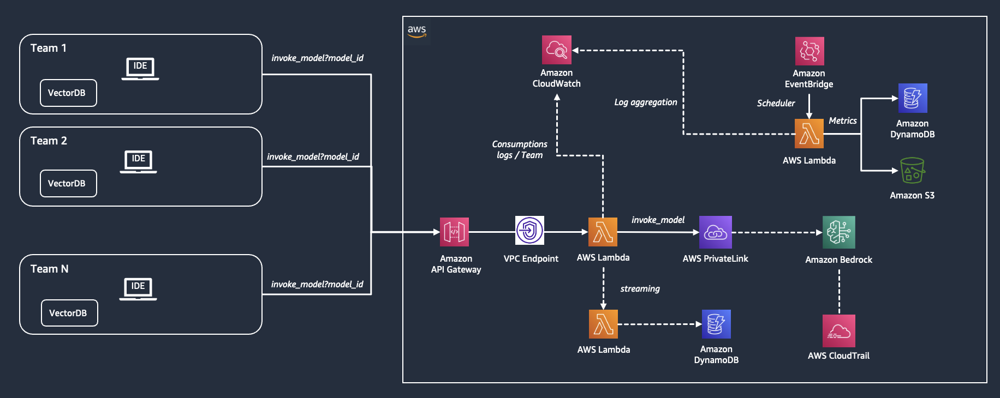

# Build and track a internal SaaS service with Amazon Bedrock

In this repository, we show you how to build an internal SaaS service to access foundation models with Amazon Bedrock in a multi-tenant architecture. An internal software as a service (SaaS) for foundation models can address governance requirements while providing a simple and consistent interface for the end users. API gateways are a common design pattern that enable consumption of services with standardization and governance. They can provide loose coupling between model consumers and the model endpoint service that gives flexibility to adapt to changing model versions, architectures and invocation methods.

1. [Project Description](#project-description)
2. [API Specifications](#api-specifications)
3. [Reporting Costs Example](#reporting-costs-example)
4. [Deploy Stack](#deploy-stack)

## Project Description

Multiple tenants within an enterprise could simply reflect to multiple teams or projects accessing LLMs via REST APIs just like other SaaS services. IT teams can add additional governance and controls over this SaaS layer. In this cdk example, we focus specifically on showcasing multiple tenants with different cost centers accessing the service via API gateway. An internal service is responsible to perform usage and cost tracking per tenant and aggregate that cost for reporting. Additionally, the API layer is updated to allow equal usage across all tenants to match the on-demand limits of the Bedrock service. The cdk template provided here deploys all the required resources to the AWS account. 



The CDK Stack deploys the following resources : 
1. Private Networking environment with VPC, Private Subnets, VPC Endpoints for Lambda, API Gateway, and Amazon Bedrock
2. API gateway
2. Lambda functions  to list foundation models on Bedrock and invoke models on Bedrock 
3. Lambda function to aggregate usage and cost metering 
4. EventBridge to trigger the metering aggregation on a regular frequency
5. S3 buckets to store the metering output
6. Cloudwatch logs to collect logs from Lambda invocations

Sample notebook in the notebooks folder can be used to invoke Bedrock as either one of the teams/cost_center. API gateway then routes the request to the Bedrock lambda that invokes Bedrock and logs the usage metrics to cloudwatch. EventBridge triggers the metering lambda on a regular frequnecy to aggregate metrics from the cloudwatch logs and generate aggregate usage and cost metrics for the chosen granularity level. The metrics are stored in S3 and can further be visualized with custom reports. 

## API Specifications

The CDK Stack creates Rest API compliant with OpenAPI specification standards.

### Swagger

```
{
  "swagger" : "2.0",
  "info" : {
    "version" : "2023-11-02T18:22:47Z",
    "title" : "<REST_API_NAME>"
  },
  "host" : "<HOST>.execute-api.<REGION>.amazonaws.com",
  "basePath" : "/prod",
  "schemes" : [ "https" ],
  "paths" : {
    "/invoke_model" : {
      "post" : {
        "produces" : [ "application/json" ],
        "responses" : {
          "401" : {
            "description" : "401 response",
            "schema" : {
              "$ref" : "#/definitions/Error"
            },
            "headers" : {
              "Access-Control-Allow-Origin" : {
                "type" : "string"
              }
            }
          }
        },
        "security" : [ {
          "api_key" : [ ]
        } ]
      }
    },
    "/list_foundation_models" : {
      "get" : {
        "produces" : [ "application/json" ],
        "responses" : {
          "401" : {
            "description" : "401 response",
            "schema" : {
              "$ref" : "#/definitions/Error"
            },
            "headers" : {
              "Access-Control-Allow-Origin" : {
                "type" : "string"
              }
            }
          }
        },
        "security" : [ {
          "api_key" : [ ]
        } ]
      }
    }
  },
  "securityDefinitions" : {
    "api_key" : {
      "type" : "apiKey",
      "name" : "x-api-key",
      "in" : "header"
    }
  },
  "definitions" : {
    "Error" : {
      "type" : "object",
      "properties" : {
        "message" : {
          "type" : "string"
        }
      },
      "title" : "Error Schema"
    }
  }
}
```

### OpenAPI 3

```
{
  "openapi" : "3.0.1",
  "info" : {
    "title" : "<REST_API_NAME>",
    "version" : "2023-11-02T18:22:47Z"
  },
  "servers" : [ {
    "url" : "https://<HOST>.execute-api.<REGION>.amazonaws.com/{basePath}",
    "variables" : {
      "basePath" : {
        "default" : "prod"
      }
    }
  } ],
  "paths" : {
    "/list_foundation_models" : {
      "get" : {
        "responses" : {
          "401" : {
            "description" : "401 response",
            "headers" : {
              "Access-Control-Allow-Origin" : {
                "schema" : {
                  "type" : "string"
                }
              }
            },
            "content" : {
              "application/json" : {
                "schema" : {
                  "$ref" : "#/components/schemas/Error"
                }
              }
            }
          }
        },
        "security" : [ {
          "api_key" : [ ]
        } ]
      }
    },
    "/invoke_model" : {
      "post" : {
        "responses" : {
          "401" : {
            "description" : "401 response",
            "headers" : {
              "Access-Control-Allow-Origin" : {
                "schema" : {
                  "type" : "string"
                }
              }
            },
            "content" : {
              "application/json" : {
                "schema" : {
                  "$ref" : "#/components/schemas/Error"
                }
              }
            }
          }
        },
        "security" : [ {
          "api_key" : [ ]
        } ]
      }
    }
  },
  "components" : {
    "schemas" : {
      "Error" : {
        "title" : "Error Schema",
        "type" : "object",
        "properties" : {
          "message" : {
            "type" : "string"
          }
        }
      }
    },
    "securitySchemes" : {
      "api_key" : {
        "type" : "apiKey",
        "name" : "x-api-key",
        "in" : "header"
      }
    }
  }
}
```

## Reporting Costs Example

| team_id | model_id | input_tokens | output_tokens | invocations | input_cost | output_cost |
|---------|----------|--------------|---------------|-------------|------------|-------------|
| tenant1 | amazon.titan-tg1-large | 24000        | 2473          | 1000        | 0.0072     | 0.00099     |
| tenant1 | anthropic.claude-v2 | 2448         | 4800          | 24          | 0.02698    | 0.15686     |
| tenant2 | amazon.titan-tg1-large | 35000        | 52500         | 350         | 0.0105     | 0.021       |
| tenant2 | ai21.j2-grande-instruct | 4590         | 9000          | 45          | 0.05738    | 0.1125      |
| tenant2 | anthropic.claude-v2 | 1080         | 4400          | 20          | 0.0119     | 0.14379     |

## Deploy Stack

### Step 1

Edit the global configs used in the CDK Stack. For each organizational units that requires a dedicated multi-tenant SaaS environment, create an entry in [setup/configs.json](./setup/configs.json)

```
[
  {
    "STACK_PREFIX": "", # unit 1 with dedicated SaaS resources
    "BEDROCK_ENDPOINT": "https://bedrock-runtime.{}.amazonaws.com", # bedrock-runtime endpoint used for invoking Amazon Bedrock
    "BEDROCK_SDK_URL": "https://d2eo22ngex1n9g.cloudfront.net/Documentation/SDK/bedrock-python-sdk.zip", # URL for the Boto3 SDK
    "LANGCHAIN_REQUIREMENTS": "aws-lambda-powertools langchain==0.0.309 pydantic PyYaml", # python modules installed for langchain layer
    "PANDAS_REQUIREMENTS": "pandas", # python modules installed for pandas layer
    "VPC_CIDR": "10.10.0.0/16" # CIDR used for the private VPC Env
  },
  {
    "STACK_PREFIX": "" # unit 2 with dedicated SaaS resources,
    "BEDROCK_ENDPOINT": "https://bedrock-runtime.{}.amazonaws.com", # bedrock-runtime endpoint used for invoking Amazon Bedrock
    "BEDROCK_SDK_URL": "https://d2eo22ngex1n9g.cloudfront.net/Documentation/SDK/bedrock-python-sdk.zip", # URL for the Boto3 SDK
    "LANGCHAIN_REQUIREMENTS": "aws-lambda-powertools langchain==0.0.309 pydantic PyYaml", # python modules installed for langchain layer
    "PANDAS_REQUIREMENTS": "pandas", # python modules installed for pandas layer
    "VPC_CIDR": "10.20.0.0/16" # CIDR used for the private VPC Env
  },
]
```

### Step 2

Execute the following commands:

```
chmod +x deploy_stach.sh
```

```
./deploy_stach.sh
```